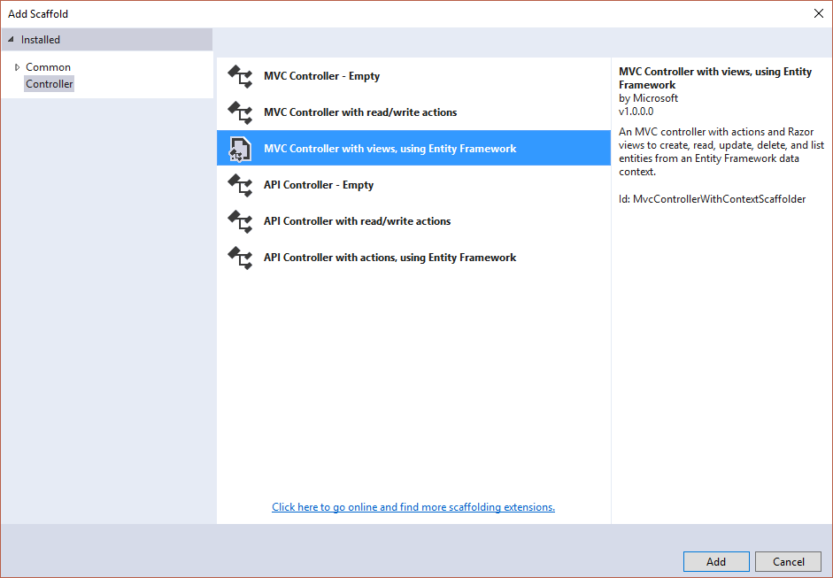

# Практика №5

## Темы

1. Моделирование предметной области в Entity Framework Core
2. CRUD-контроллеры

## Задачи

1. Ознакомиться с заготовленным проектом
2. Завершить реализацию приведенной ниже предметной области:
   1. Создать классы, реализующие модель предметной области в Entity Framework Core.
   2. Добавить миграции для данных классов.
   3. Реализовать контроллеры для CRUD-а объектов классов.

  
*Рис 1. Модель предметной области*

## Материалы

### Entity Framework

#### Добавление поддержки Entity Framework в проект

Для начала необходимо установить nuget-пакеты `Microsoft.EntityFrameworkCore.SqlServer` и `Microsoft.EntityFrameworkCore.Tools`. При установке этого пакета автоматически будут установлены зависимости: Microsoft.EntityFrameworkCore.Relational и Microsoft.EntityFrameworkCore, содержащие все необходимое для работы с Entity Framework Core в связке с СУБД Microsoft Sql Server.

Добавляем класс Data/ApplicationDbContext.cs со следующим содержимым:

```csharp
public class ApplicationDbContext : DbContext
{
    public ApplicationDbContext(DbContextOptions options)
        : base(options)
    {
    }
}
```

Данный класс будет являться контекстом Entity Framework - основным классом отвечающим за содинение с базой данных и содержащим набор `DbSet`-ов - предоставляющими доступ к конкретным таблицам.

Теперь необходимо зарегистрировать контекст Entity Framework в контейнере Dependency Injection

```csharp
public void ConfigureServices(IServiceCollection services)
{
    // Add framework services.
    services.AddDbContext<ApplicationDbContext>(options =>
        options.UseSqlServer(this.Configuration.GetConnectionString("DefaultConnection")));

    services.AddMvc();
}
```

И прописать строку подключения в конфигурационном файле `appsettings.json`

```json
"ConnectionStrings": {
    "DefaultConnection": "Server=(localdb)\\mssqllocaldb;Database=aspnet-Backend5-3e04b8e6-f237-4bd5-b98f-8b7d7a4b3d8e;Trusted_Connection=True;MultipleActiveResultSets=true"
  },
```

Строка подключения определяет параметры соединения с базой данных, такие как:

* `Server=(localdb)\\mssqllocaldb` - адрес сервера баз данных, в данном случае используется локальных экземпляр Microsoft SQL Server LocalDb.
* `Database=aspnet-Backend5-3e04b8e6-f237-4bd5-b98f-8b7d7a4b3d8e` - имя базы данных на сервере, к которой необходимо выполнить подключение. По умолчанию определяется как `aspnet-{ИмяПроекта}-{СлучайныйGUID}`, но может быть изменено на любое.
* `Trusted_Connection=True` - указывает на то, что соединение с сервером баз данных будет выполняться от имени текущего пользователя Windows с использованием его учетных данных.
* `MultipleActiveResultSets=true` - позволяет выполнять новый запрос до завершения работы с результатом предыдущего.

Более подробно про форматы строк подключения можно почитать на этом сайте: [https://www.connectionstrings.com/](https://www.connectionstrings.com/)


В качестве последнего шага добавления поддержки Entity Framework Core добавить в метод `Startup.Configure` следующий фрагмент кода, который будет отвечать за автоматическое создание базы данных (в случае ее отсутствия) и за автоматическое применение миграций.

```csharp
using (var scope = app.ApplicationServices.GetRequiredService<IServiceScopeFactory>().CreateScope())
using (var context = scope.ServiceProvider.GetService<ApplicationDbContext>())
{
    context.Database.Migrate();
}
```

#### Моделирование предметной области

##### Простая сущность

Начнем с простой, не зависящей ни от кого сущности, например с сущности `Hospital`. В модели предметной области у нее определены 2 атрибута: `Name` и `Address`. Помимо этих атрибутов, каждая сущность Entity Framework Core должна иметь уникальный идентификатор - первичный ключ. Первичный ключ может быть определен автоматически (свойство с именем `Id`) либо вручную (в том числе композитный первичный ключ) с помощеью Fluent Api. С учетом этого получаем следующий класс, предствляющий элемент модели предметной области `Hospital`:

```csharp
public class Hospital
{
    public Int32 Id { get; set; }

    [Required]
    [MaxLength(200)]
    public String Name { get; set; }

    public String Address { get; set; }
}
```

В данном случае `Id` будет выступать в качестве сурогатного первичного ключа с автоматически генерируемым значением. 

Возможные типы первичного ключа:

* Целое число (`Int32`). Если задано как единственный ключ - для него по умолчанию будет включена автоматическая генерация возрастающих неповторяющихся значений.
* Строка (`String`). Значение ключа должно задаваться явно. Должна быть определена максимальная длина строки (с помощью атрибута MaxLength).
* Глобальный уникальный идентификатор (`Guid`). Значение ключа должно задаваться явно, но можно задавать его значение как Guid.NewGuid() - будет генерироваться уникальный неповторяющийся идентификатор.

Теперь данный класс необходимо зарегистрировать в классе-контексте Entity Framework Core. Для этого, добавим в класс `ApplicationDbContext` новое свойство типа `DbSet<Hospital>` с именем `Hospitals`:

```csharp
public class ApplicationDbContext : DbContext
{
    public ApplicationDbContext(DbContextOptions options)
        : base(options)
    {
    }

    public DbSet<Hospital> Hospitals { get; set; }
}
```

Важно: имя таблицы, которая будет создана для хранения объектов данного класса будет определяться на основании имени свойства в классе-контексте. В связи с этим, крайне не рекомендуется менять это имя после того, как таблица будет создана.

Entity Framework Core включает в контекст:

* Классы, для которых явно добавлен `DbSet` в контекст.
* Классы, зарегистрированные через Fluent Api.
* Классы, на которые есть ссылки из классов включенных в контекст (простые ссылки и коллекции).

В связи с этим, для обеспечения целостности именования таблиц и чтобы избежать проблем с их внезапной переименовкой (например если изначально класс был включен неявно, а потом его включили явно - имя таблицы, предполагаемое для такого класса может измениться что может привести к ошибке) рекомендуется явно добавлять `DbSet` для всех классов явно.

После добавления класса в контекст необходимо добавить новую миграцию - набор инструкций, которые используются для приведения схемы базы данных в соответствие объектной модели данных.

Управление миграциями можно производить с помощью встроенного инструмента `Package Manager Console`. Открыть который можно следующим образом: `Tools` -> `NuGet Package Manager` -> `Package Manager Console`.


В результате должно открыться следующее окно:


На старых операционных системах при открытие `Package Manager Console` может появиться ошибка, что установленная версия `PowerShell` не соответствует требуемой (3.0). В таком случае, необходимо установить обновление, которое можно скачать по следующей ссылке: [https://www.microsoft.com/en-us/download/details.aspx?id=54616](https://www.microsoft.com/en-us/download/details.aspx?id=54616). Без данного обновления работа с миграциями будет невозможна.

Для добавления миграции необходимо выполнить в `Package Manager Console` следующую команду:

```
Add-Migration AddHospitals
```

Где `AddHospitals` - название миграции. К названиями миграции применяются те же требования, что и к именам классов (т.к. будет создан класс с таким именем).

В случае успешного выполнения отобразится следующее сообщение

```
To undo this action, use Remove-Migration.
```

В результате в папке Migrations будет создан файл с кодом миграции имеющий имя следующего вида: `20170531064827_AddHospitals`, где `20170531064827` - UTC-дата и время создания миграции в формате `yyyyMMddHHmmss` (результат выполнения выражения `DateTime.UtcNow.ToString("yyyyMMddHHmmss")`), а `AddHospitals` - имя миграции, заданное при выполнении команды `Add-Migration`.

Данный файл имеет следующее содержимое и описывает 2 процесса: применение миграции - создание таблицы для хранения объетов класса `Hospital` и откат миграции - удаление соответствующей таблицы.

```csharp
public partial class AddHospitals : Migration
{
    protected override void Up(MigrationBuilder migrationBuilder)
    {
        migrationBuilder.CreateTable(
            name: "Hospitals",
            columns: table => new
            {
                Id = table.Column<int>(nullable: false)
                    .Annotation("SqlServer:ValueGenerationStrategy", SqlServerValueGenerationStrategy.IdentityColumn),
                Address = table.Column<string>(nullable: true),
                Name = table.Column<string>(maxLength: 200, nullable: false)
            },
            constraints: table =>
            {
                table.PrimaryKey("PK_Hospitals", x => x.Id);
            });
    }

    protected override void Down(MigrationBuilder migrationBuilder)
    {
        migrationBuilder.DropTable(
            name: "Hospitals");
    }
}
```

Если необходимо удалить миграцию, то это можно сделать только с помощью команды `Remove-Migration`. Удаление класса миграции вручную может привести к повреждению модели данных и невозможности дальнейшей работы с Entity Framework Core. Также, если миграция уже была применена к базе данных - ее необходимо перед удалением откатить.

Для применения миграций к базе данных можно выполнить команду: `Update-Database`. Выполнение данной команды приведет к применению всех миграций, которые еще не были применены к данной базе данных (учет миграций ведется в специальной таблице `__EFMigrationsHistory`).

Для отката миграции необходимо выполнить команду `Update-Database -Migration MigrationName`, где `MigrationName` - имя миграции, на которую необходимо выполнить откат (будет выполнен откат всех следующих за ней миграций) или `0`, если необходимо откатить все миграции.

Помимо класса с кодом миграции будет создан класс `ApplicationDbContextModelSnapshot` - содержащий текущую версию модели данных. В данном классе не рекомендуется вносить никакие изменения, так как это может нарушить работу Entity Framework Core.

Для того, чтобы подключиться к полученной базе данных можно использовать встроенные в Visual Studio инструменты: `Tools` -> `Connect to Database...`

В открывшемся окне необходимо выбрать:

* Data source: Microsoft SQL Server
* Data provider: .NET Framework Data Provider for SQL Server


И нажать `Continue`. В последующем окне:

* Server name: `(localdb)\mssqllocaldb`
* Select or enter a databsse name: имя базы данных `aspnet-Backend5-3e04b8e6-f237-4bd5-b98f-8b7d7a4b3d8e`


В результат откроется `Server Explorer`, через который можно просмотреть, какие таблицы есть в базе данных, какая у них структура и выполнить произвольные SQL-запросы с ним.

##### Зависимая сущность

Теперь перейдем к сущности `Ward`, которая зависит от сущности `Hospital` и связана с ней связью один-ко-многим. У самой сущности `Ward` определен только один атрибут `Name`, но нам помимо него понадобятся еще:

* Свойство `Int32 Id` - для первичного ключа.
* Пара свойств `Hospital Hospital` и `Int32 HospitalId` для внешнего ключа.

Для добавления внешнего ключа необходимо объявить свойство, тип которого соответствует сущности, на которую должен сослаться внешний ключ (`Hospital Hospital`), а также свойство, дублирующее первичный ключ сущности, на которую идет ссылка (`Int32 HospitalId`) (либо несколько свойств, если у сущности, на которую идет ссылка композитный первичный ключ).

```csharp
public class Ward
{
    public Int32 Id { get; set; }

    public Int32 HospitalId { get; set; }

    public Hospital Hospital { get; set; }

    public String Name { get; set; }
}
```

Помимо этого, рекомендуется в классе `Hospital` добавить коллекцию объектов нового класса `Ward`:

```csharp
public ICollection<Ward> Wards { get; set; }
```

После этого, добавляем сущность в класс-контекст:

```csharp
public DbSet<Ward> Wards { get; set; }
```

И создаем новую миграцию:

```
Add-Migration AddWards
```

```csharp
public partial class AddWards : Migration
{
    protected override void Up(MigrationBuilder migrationBuilder)
    {
        migrationBuilder.CreateTable(
            name: "Wards",
            columns: table => new
            {
                Id = table.Column<int>(nullable: false)
                    .Annotation("SqlServer:ValueGenerationStrategy", SqlServerValueGenerationStrategy.IdentityColumn),
                HospitalId = table.Column<int>(nullable: false),
                Name = table.Column<string>(nullable: true)
            },
            constraints: table =>
            {
                table.PrimaryKey("PK_Wards", x => x.Id);
                table.ForeignKey(
                    name: "FK_Wards_Hospitals_HospitalId",
                    column: x => x.HospitalId,
                    principalTable: "Hospitals",
                    principalColumn: "Id",
                    onDelete: ReferentialAction.Cascade);
            });

        migrationBuilder.CreateIndex(
            name: "IX_Wards_HospitalId",
            table: "Wards",
            column: "HospitalId");
    }

    protected override void Down(MigrationBuilder migrationBuilder)
    {
        migrationBuilder.DropTable(
            name: "Wards");
    }
}
```

##### Зависимая сущность с ID-зависимостью

Теперь рассмотрим создание зависимой сущности с ID-зависимостью на примере `HospitalPhone`: вместо `Id` в качестве первичного ключа будем использовать композитный первичный ключ, состоящий из `HospitalId` (по совместительству являющегося внешним ключом к сущности `Hospital`) и `PhoneId`:

```csharp
public class HospitalPhone
{
    public Int32 HospitalId { get; set; }

    public Hospital Hospital { get; set; }

    public Int32 PhoneId { get; set; }

    public String Number { get; set; }
}
```

Для такой сущности Entity Framework Core не сможет самостоятельно определить первичный ключ и необходимо использовать Fluent Api для явного его определения. Для этого в классе `ApplicationDbContext` необходимо переопределить метод `OnModelCreating` и добавить в него следующий код:

```csharp
modelBuilder.Entity<HospitalPhone>()
    .HasKey(x => new { x.HospitalId, x.PhoneId });
```

Аналогично с `Ward`, рекомендуется добавить в класс `Hospital` коллекцию объектов класса `HospitalPhone`:

```csharp
public ICollection<HospitalPhone> Phones { get; set; }
```

После этого, добавляем сущность в класс-контекст:

```csharp
public DbSet<HospitalPhone> HospitalPhones { get; set; }
```

И создаем новую миграцию:

```
Add-Migration AddHospitalPhones
```

```csharp
public partial class AddHospitalPhones : Migration
{
    protected override void Up(MigrationBuilder migrationBuilder)
    {
        migrationBuilder.CreateTable(
            name: "HospitalPhone",
            columns: table => new
            {
                HospitalId = table.Column<int>(nullable: false),
                PhoneId = table.Column<int>(nullable: false),
                Number = table.Column<string>(nullable: true)
            },
            constraints: table =>
            {
                table.PrimaryKey("PK_HospitalPhone", x => new { x.HospitalId, x.PhoneId });
                table.ForeignKey(
                    name: "FK_HospitalPhone_Hospitals_HospitalId",
                    column: x => x.HospitalId,
                    principalTable: "Hospitals",
                    principalColumn: "Id",
                    onDelete: ReferentialAction.Cascade);
            });
    }

    protected override void Down(MigrationBuilder migrationBuilder)
    {
        migrationBuilder.DropTable(
            name: "HospitalPhone");
    }
}
```

##### Связь многие-ко-многим

Как и базы данных, Entity Framework Core не поддерживает связь многие-ко-многим напрямую. Для того, чтобы ее реализовать необходимо создать класс, который будет являться промещуточной сущностью в связи многие-ко-многим:

```csharp
public class HospitalLab
{
    public Int32 HospitalId { get; set; }

    public Hospital Hospital { get; set; }

    public Int32 LabId { get; set; }

    public Lab Lab { get; set; }
}
```

Данный класс должен иметь внешние ключи на связываемые сущности, которые в свою очередь собираются в композитный первичный ключ с помощью Fluent Api:

```csharp
modelBuilder.Entity<HospitalLab>()
    .HasKey(x => new { x.HospitalId, x.LabId });
```

В связываемые сущности добавим коллекции объектов промежуточной сущности:

`Hospital`:

```csharp
public ICollection<HospitalLab> Labs { get; set; }
```

`Lab`:

```csharp
public ICollection<HospitalLab> Hospitals { get; set; }
```

Добавим промежуточную сущность в класс-контекст:

```csharp
public DbSet<HospitalLab> HospitalLabs { get; set; }
```

И создаем новую миграцию:

```
Add-Migration AddHospitalLabs
```

```csharp
public partial class AddHospitalLabs : Migration
{
    protected override void Up(MigrationBuilder migrationBuilder)
    {
        migrationBuilder.CreateTable(
            name: "HospitalLabs",
            columns: table => new
            {
                HospitalId = table.Column<int>(nullable: false),
                LabId = table.Column<int>(nullable: false)
            },
            constraints: table =>
            {
                table.PrimaryKey("PK_HospitalLabs", x => new { x.HospitalId, x.LabId });
                table.ForeignKey(
                    name: "FK_HospitalLabs_Hospitals_HospitalId",
                    column: x => x.HospitalId,
                    principalTable: "Hospitals",
                    principalColumn: "Id",
                    onDelete: ReferentialAction.Cascade);
                table.ForeignKey(
                    name: "FK_HospitalLabs_Labs_LabId",
                    column: x => x.LabId,
                    principalTable: "Labs",
                    principalColumn: "Id",
                    onDelete: ReferentialAction.Cascade);
            });

        migrationBuilder.CreateIndex(
            name: "IX_HospitalLabs_LabId",
            table: "HospitalLabs",
            column: "LabId");
    }

    protected override void Down(MigrationBuilder migrationBuilder)
    {
        migrationBuilder.DropTable(
            name: "HospitalLabs");
    }
}
```

## CRUD controllers

CRUD (create, read, update, delete) - набор базовых операций с сущностями. CRUD-контроллер - контроллер, позволяющий совершать CRUD-операции.

### Standard scaffolded CRUD

ASP.NET Core позволяет выполнять автоматическую генерацию CRUD-контроллеров на основании модели данных. Для этого в контекстном меню папки `Controllers` необходимо выбрать `Add` -> `Controller...`


В открывшемся окне выбрать `MVC Controller with views, using Entity Framework`



И затем указать класс, для которого необходимо выполнить генерацию CRUD-контроллера (`Model class`), класс-контекст (`Data context class`) и другие параметры генерации


В результате будет сгенерирован класс `HospitalsController` и набор представлений к нему. Рассмотрим более подробно данный класс.

В конструкторе данного класса выполняется подключение класса-контекста как службы (через dependency injection) и сохранение его в поле класса для дальнейшего использования в методах.

```csharp
private readonly ApplicationDbContext context;

public HospitalsController(ApplicationDbContext context)
{
    this.context = context;    
}
```

#### Index

Action Index отвечает за получение и отображение списка всех сущностей и реализуется следующим методом:

```csharp
public async Task<IActionResult> Index()
{
    return this.View(await this.context.Hospitals.ToListAsync());
}
```

Данный метод является асинхронным (модификатор `async`), что позволяет в нем использовать асинхронные методы (`await this.context.Hospitals.ToListAsync()`).

Вызов метода-расширения `ToListAsync` у `DbSet`-а `context.Hospitals` будет транслирован в SQL-запрос:

```sql
SELECT * FROM Hospitals
```

И вернет все сущности типа `Hospital`, которые затем будут переданы в представление.

#### Details

Action Details отвечает за получение подробной информации об одной сущности и реализуется следующим методом:

```csharp
public async Task<IActionResult> Details(int? id)
{
    if (id == null)
    {
        return this.NotFound();
    }

    var hospital = await this.context.Hospitals
        .SingleOrDefaultAsync(m => m.Id == id);
    if (hospital == null)
    {
        return this.NotFound();
    }

    return this.View(hospital);
}
```

`return this.NotFound();` позволяет отобразить в качестве результата ошибку 404 вместо страницы.

`this.context.Hospitals.SingleOrDefaultAsync(m => m.Id == id)` позволяет получить одну сущность типа `Hospital` (метод `SingleOrDefaultAsync` возвращает единственную сущность, удовлетворяющую укзаанному условию `m.Id == id` либо `null` если такая сущность не была найдена) с помощью следующего SQL-запроса:

```sql
SELECT * FROM Hospitals WHERE Id = @id
```

#### Create

Action Create отвечает за создание новой сущности и реализуется следующей парой методов:

```csharp
public IActionResult Create()
{
    return this.View();
}

[HttpPost]
[ValidateAntiForgeryToken]
public async Task<IActionResult> Create([Bind("Id,Name,Address")] Hospital hospital)
{
    if (ModelState.IsValid)
    {
        this.context.Add(hospital);
        await this.context.SaveChangesAsync();
        return this.RedirectToAction("Index");
    }
    return this.View(hospital);
}
```

Задача первого метода - отобразить форму создания новой сущности (при необходимости подгрузить туда необходимые данные). Задача второго метода - обработать отправку формы и в случае если все хорошо - создать новую сущность в базе данных.

`this.context.Add(hospital)` - помечает объект `hospital` на добавление в базу данных. Само добавление (SQL-команда `INSERT`) будет выполнено только после вызова `await this.context.SaveChangesAsync()`.

`return this.RedirectToAction("Index");` приведет к тому, что пользователь будет перенаправлен на страницу, соответствующую action-у `Index`.

#### Edit

Action Edit предоставляет возможность внесения изменений в сущность и реализуется следующей парой методов:

```csharp
public async Task<IActionResult> Edit(int? id)
{
    if (id == null)
    {
        return this.NotFound();
    }

    var hospital = await this.context.Hospitals.SingleOrDefaultAsync(m => m.Id == id);
    if (hospital == null)
    {
        return this.NotFound();
    }
    return this.View(hospital);
}

[HttpPost]
[ValidateAntiForgeryToken]
public async Task<IActionResult> Edit(int id, [Bind("Id,Name,Address")] Hospital hospital)
{
    if (id != hospital.Id)
    {
        return this.NotFound();
    }

    if (this.ModelState.IsValid)
    {
        try
        {
            this.context.Update(hospital);
            await this.context.SaveChangesAsync();
        }
        catch (DbUpdateConcurrencyException)
        {
            if (!this.HospitalExists(hospital.Id))
            {
                return this.NotFound();
            }
            else
            {
                throw;
            }
        }
        return this.RedirectToAction("Index");
    }
    return this.View(hospital);
}

private bool HospitalExists(int id)
{
    return this.context.Hospitals.Any(e => e.Id == id);
}
```

`this.context.Update(hospital)` помечает сущность `hospital` как измененную.

`DbUpdateConcurrencyException` - исключение, которое возникает если не была обновлена ни одна запись (например, если записи нет).

`this.context.Hospitals.Any(e => e.Id == id)` возвращает `true` если существует хотя бы одна запись, удовлетворяющая условию `e.Id == id`.

#### Delete

Action Delete предоставляет возможность удалить сущность и реализуется следующей парой методов.

```csharp
public async Task<IActionResult> Delete(int? id)
{
    if (id == null)
    {
        return this.NotFound();
    }

    var hospital = await this.context.Hospitals
        .SingleOrDefaultAsync(m => m.Id == id);
    if (hospital == null)
    {
        return this.NotFound();
    }

    return this.View(hospital);
}

[HttpPost, ActionName("Delete")]
[ValidateAntiForgeryToken]
public async Task<IActionResult> DeleteConfirmed(int id)
{
    var hospital = await this.context.Hospitals.SingleOrDefaultAsync(m => m.Id == id);
    this.context.Hospitals.Remove(hospital);
    await this.context.SaveChangesAsync();
    return this.RedirectToAction("Index");
}
```

Поскольку оба метода имеют один и тот же набор параметров, они не могут оба быть названы `Delete` и используется атрибут `ActionName`, чтобы указать что второй метод также относится как action-у Delete.

### CRUD controller with separate create/edit model

Существенным недостатком CRUD-контроллеров, генерируемых приведенным выше способом является то, что используется один и тот же класс и в качестве модели данных и в качестве модели представления. Данные модели решают разные задачи и имеют разные особенности и далеко не всегда их можно совместить в одном классе. Помимо этого, передача объекта, полученного с помощью model binding-а с формы напрямую в Entity Framework может приводить к так называемой overposting attack.

В связи с этим рекомендуется использовать генерированные CRUD-контроллеры только в качестве основы, при этом явно разделя модель данных и модель представления (что потребует изменение логики работы некоторых методов).

Рассмотрим это на примере `HospitalsController`.

#### Create

Для начала определим модель представления - модель, в которую будет биндиться форма, заполняемая пользователем.

```csharp
public class HospitalCreateModel
{
    [Required]
    [MaxLength(200)]
    public String Name { get; set; }

    public String Address { get; set; }

    public String Phones { get; set; }
}
```

Помимо `Name` и `Address` мы определим еще строковое свойство `Phones`, в котором пользователь будет указывать через запятую номера телефонов и которое потом будет разобрано и преобразовано в набор сущностей `HospitalPhone`.

В GET-методе `Create` создадим экземпляр данной модели и передадим его в представление:

```csharp
public IActionResult Create()
{
    return this.View(new HospitalCreateModel());
}
```

В POST-методе `Create` изменим аргументы. Вместо:

```csharp
public async Task<IActionResult> Create([Bind("Id,Name,Address")] Hospital hospital)
```

Сделаем

```csharp
public async Task<IActionResult> Create(HospitalCreateModel model)
```

И изменим его реализацию:

```csharp
[HttpPost]
[ValidateAntiForgeryToken]
public async Task<IActionResult> Create(HospitalCreateModel model)
{
    if (this.ModelState.IsValid)
    {
        var hospital = new Hospital
        {
            Name = model.Name,
            Address = model.Address,
            Phones = new Collection<HospitalPhone>()
        };
        if (model.Phones != null)
        {
            var phoneId = 1;
            foreach (var phone in model.Phones.Split(',').Select(x => x.Trim()).Where(x => !String.IsNullOrEmpty(x)))
            {
                hospital.Phones.Add(new HospitalPhone
                {
                    PhoneId = phoneId++,
                    Number = phone
                });
            }
        }

        this.context.Hospitals.Add(hospital);
        await this.context.SaveChangesAsync();
        return this.RedirectToAction("Index");
    }

    return this.View(model);
}
```

Теперь мы не получаем объект класса `Hospital` через model binding, а создаем его вручную, заполняя его данным, полученными через модель представления.

В представлении `Hospitals/Create.cshtml` необходимо изменить класс, используемый в качестве модели (`@model Backend5.Models.ViewModels.HospitalCreateModel`) и добавить поле для редактирования свойства `Phones`.

#### Edit

Снова определим модель представления:

```csharp
public class HospitalEditModel
{
    [Required]
    [MaxLength(200)]
    public String Name { get; set; }

    public String Address { get; set; }

    public String Phones { get; set; }
}
```

Примечание: зачастую, можно использовать один и тот же класс в качестве модели представления как для Create, так и для Edit.

И внесем следующие изменения в методы контроллера:

GET-метод:

```csharp
public async Task<IActionResult> Edit(Int32? id)
{
    if (id == null)
    {
        return this.NotFound();
    }

    var hospital = await this.context.Hospitals
        .Include(x => x.Phones)
        .SingleOrDefaultAsync(m => m.Id == id);
    if (hospital == null)
    {
        return this.NotFound();
    }

    var model = new HospitalEditModel
    {
        Name = hospital.Name,
        Address = hospital.Address,
        Phones = String.Join(", ", hospital.Phones.OrderBy(x => x.PhoneId).Select(x => x.Number))
    };

    return this.View(model);
}
```

`var hospital = await this.context.Hospitals.Include(x => x.Phones).SingleOrDefaultAsync(m => m.Id == id);` получает сущность типа `Hospital` из базы данных и прогружает у нее коллекцию `Phones`.

Примечание: если не использовать `Include`, то Entity Framework не будет прогружать коллекции и ссылки на другие сущности.

Так как теперь используется отдельная модель представления, то необходимо ее предварительно заполнить на основании данных из базы данных:

```csharp
var model = new HospitalEditModel
{
    Name = hospital.Name,
    Address = hospital.Address,
    Phones = String.Join(", ", hospital.Phones.OrderBy(x => x.PhoneId).Select(x => x.Number))
};
```

POST-метод:

```csharp
[HttpPost]
[ValidateAntiForgeryToken]
public async Task<IActionResult> Edit(Int32? id, HospitalEditModel model)
{
    if (id == null)
    {
        return this.NotFound();
    }

    var hospital = await this.context.Hospitals
        .Include(x => x.Phones)
        .SingleOrDefaultAsync(m => m.Id == id);
    if (hospital == null)
    {
        return this.NotFound();
    }

    if (this.ModelState.IsValid)
    {
        hospital.Name = model.Name;
        hospital.Address = model.Address;
        var phoneId = hospital.Phones.Any() ? hospital.Phones.Max(x => x.PhoneId) + 1 : 1;
        hospital.Phones.Clear();
        if (model.Phones != null)
        {
            foreach (var phone in model.Phones.Split(',').Select(x => x.Trim()).Where(x => !String.IsNullOrEmpty(x)))
            {
                hospital.Phones.Add(new HospitalPhone
                {
                    PhoneId = phoneId++,
                    Number = phone
                });
            }
        }

        await this.context.SaveChangesAsync();
        return this.RedirectToAction("Index");
    }

    return this.View(model);
}
```

В данном случае вместо использования сущности, полученной через model binding как измененной сущности, происходит загрузка изначально сущности из базы данных и внесение в нее изменений на основании данных, полученных из модели представления.

В представлении `Hospitals/Edit.cshtml` необходимо изменить класс, используемый в качестве модели, добавить поле для редактирования свойства `Phone` и убрать скрытое поле `Id`.

#### Index, Details, Delete

В данных методах не происходит работы с формы, поэтому изменения, связанные, с переходом на использование отдельной модели представления не производятся. Тем не менее, в них может потребоваться внесение изменений, вызванных необходимостью подгружать дополнительные ссылки / коллекции.

### CRUD controller for dependent entities

В некоторых случаях может потребоваться организовать редактирование зависимых сущностей в контексте той сущности, от который они зависят. Например логичнее организовать редактирование сущностей типа `Ward` в контексте того `Hospital`-а, которому они принадлежат. (Вместо того, чтобы делать общий список `Ward`-ов для всех `Hospital`-ов, а `Hospital` у `Ward`-а выбирать с помощью комбобокса.)

При реализации конроллера, организующего редактирование таких сущностей необходимо внести изменения в action-ы `Index` (чтобы отображались сущности, принадлежащие только одной родительской) и `Create` (чтобы создание новой сущности сразу происходило в контексте родительской). Остальные action-ы потребуют минимум изменений, так как они работают уже с конкретной сущностью.

#### Index

Внесем следующие изменения в метод `Index`: 

```csharp
public async Task<IActionResult> Index(Int32? hospitalId)
{
    if (hospitalId == null)
    {
        return this.NotFound();
    }

    var hospital = await this.context.Hospitals
        .SingleOrDefaultAsync(x => x.Id == hospitalId);

    if (hospital == null)
    {
        return this.NotFound();
    }

    this.ViewBag.Hospital = hospital;
    var wards = await this.context.Wards
        .Include(w => w.Hospital)
        .Where(x => x.HospitalId == hospitalId)
        .ToListAsync();

    return this.View(wards);
}
```

Добавим аргумент `Int32? hospitalId`, который будет показывать, для какой сущности типа `Hospital` необходимо отобразить список `Ward`-ов. При этом убедимся что такой `Hospital` существует и сохраним его во `ViewBag` (для последующего использования в представлении).

Помимо этого, при выборе `Ward`-ов из базы данных оставим только те, которые принадлежат указанному `Hospital`-у с помощью метода `Where(x => x.HospitalId == hospitalId)`.

В результат будет выполняться примерно следующий SQL-запрос к базе данных:

```sql
SELECT * FROM Wards
INNER JOIN Hospitals ON Hospitals.Id = Wards.HospitalId
WHERE Wards.HospitalId = @hospitalId
```

Помимо этого изменения в контроллере необходимо отредактировать представление - в ссылке `Create new` необходимо передать параметр `hospitalId` (который затем будет использовать action `Create`):

```html
<a asp-action="Create" asp-route-hospitalId="@ViewBag.Hospital.Id">Create New</a>
```

#### Create

Внесем следующие изменения в GET-метод action-а `Create`:

```csharp
public async Task<IActionResult> Create(Int32? hospitalId)
{
    if (hospitalId == null)
    {
        return this.NotFound();
    }

    var hospital = await this.context.Hospitals
        .SingleOrDefaultAsync(x => x.Id == hospitalId);

    if (hospital == null)
    {
        return this.NotFound();
    }

    this.ViewBag.Hospital = hospital;
    return this.View(new WardCreateModel());
}
```

По аналогии с `Index` добавим аргумент `Int32? hospitalId`, получим его из базы данных и сохраним его во `ViewBag`. При этом поскольку необходимо сделать асинхронный запрос в базу данных сделаем этот метод тоже асинхронным.

Внесем следующие изменения в POST-метод action-а `Create`:

```csharp
[HttpPost]
[ValidateAntiForgeryToken]
public async Task<IActionResult> Create(Int32? hospitalId, WardCreateModel model)
{
    if (hospitalId == null)
    {
        return this.NotFound();
    }

    var hospital = await this.context.Hospitals
        .SingleOrDefaultAsync(x => x.Id == hospitalId);

    if (hospital == null)
    {
        return this.NotFound();
    }

    if (this.ModelState.IsValid)
    {
        var ward = new Ward
        {
            HospitalId = hospital.Id,
            Name = model.Name
        };

        this.context.Add(ward);
        await this.context.SaveChangesAsync();
        return this.RedirectToAction("Index", new { hospitalId = hospital.Id });
    }

    this.ViewBag.Hospital = hospital;
    return this.View(model);
}
```

Свойство `HospitalId` создаваемого `Ward`-а инициализируем на основании объекта класса `Hospital`, полученного на основании переданного `hospitalId`.

Помимо этого при вызове метода `RedirectToAction` добавим параметр `new { hospitalId = hospital.Id }`, что добавит соответствующий параметр к получаемому адресу страницы, который в свою очередь будет затем корректно интерпретирован методом `Index`.

Внесем следующие изменения в представление `Wards/Create.cshtml`:

Добавим в форму параметр `hospitalId`:

```html
<form asp-action="Create" asp-route-hospitalId="@ViewBag.Hospital.Id">
```

Помимо этого уберем поля, которые могли были сгенерированы для свойства `HospitalId`.

#### Details, Edit, Delete

Данные методы потребуют минимум изменений: необходимо будет добавить `.Include(x => x.Hospital)` в запросы и добавить параметр `hospitalId` в ссылки и редиректы.

### CRUD controller for many-to-many

CRUD-контроллер для промежуточной сущности в связи многие-ко-многим можно реализовать либо как контроллер для самостоятельной сущности, либо как контроллер для зависимой сущности (от одной из связываемых сущностей). В таком контроллере может не быть метода `Edit`, так как внешние ключи в промежуточной сущности объединяются в первичный ключ и не могут быть изменены после создания. Также, может не быть метода `Details`.

В качестве примера такого контроллера приведен контроллер `HospitalLabsController`, реализующий зависимый от `Hospital`-а CRUD сущности `HospitalLabs`. Также, стоит отметить что scaffold не справляется с композитными первичными ключами самостоятельно и в таком контроллере необходимо убедиться что во всех методах передаются правильные идентификаторы и что они затем корректно используются.